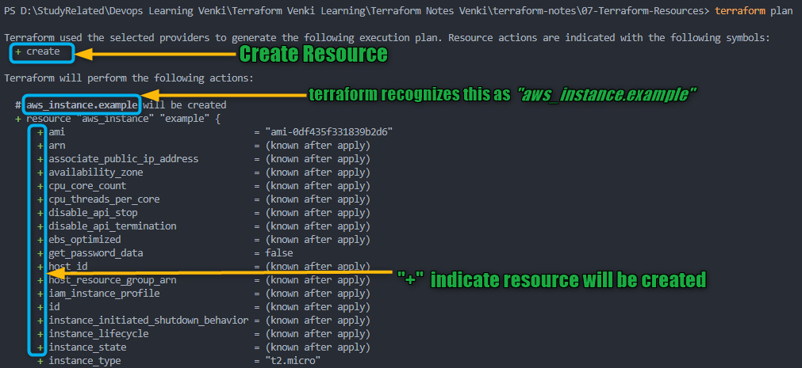
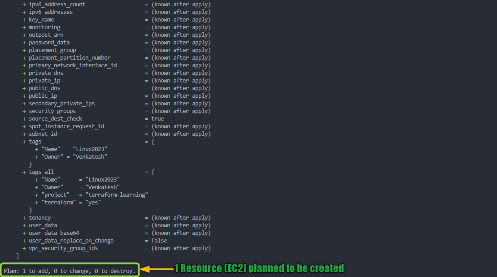
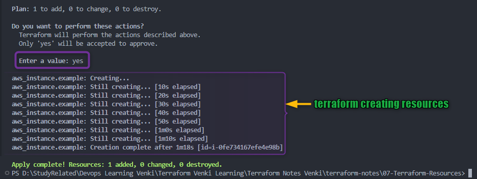
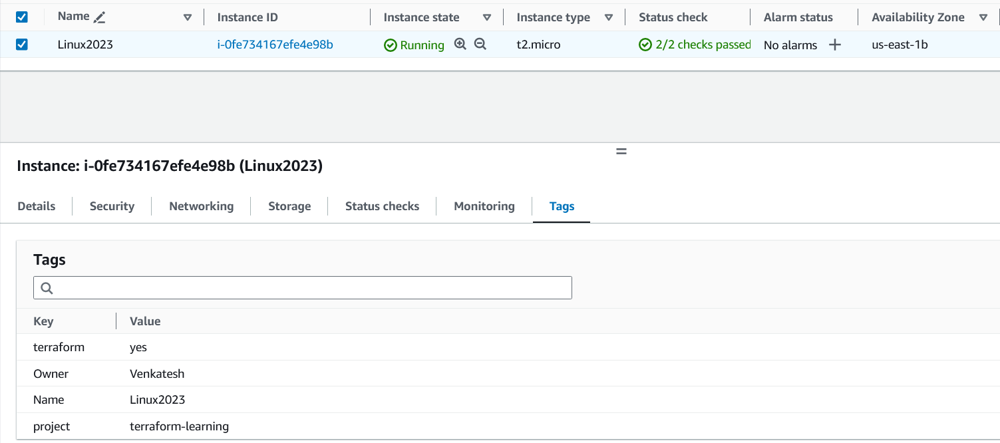
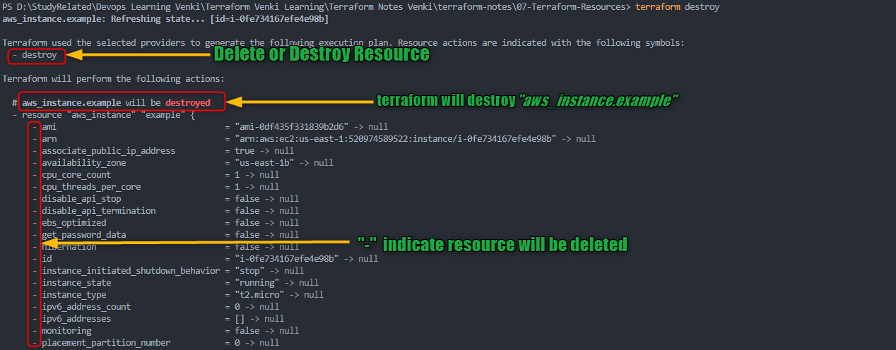
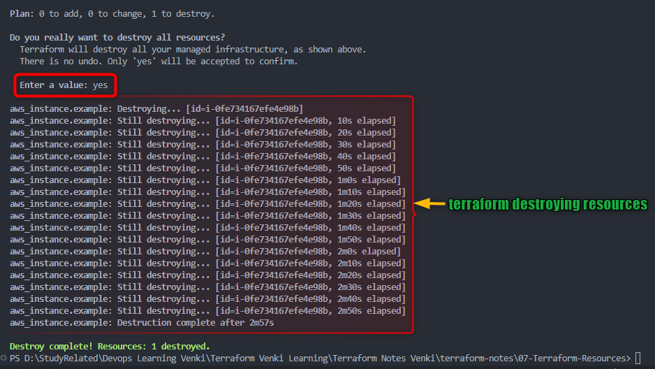

# Terraform Resource

## Terraform Resource Block

- A **Terraform Resource** is a fundamental unit used to model and manage infrastructure components. 

- Each resource block describes one or more ***infrastructure objects*** that you want to create, modify, or manage.
    - Example :  ***s3 bucket***, ***ec2 instance***, ***RDS instance***, ***Security Group***, ***VPC***

- [**resource Syntax**](https://developer.hashicorp.com/terraform/language/resources/syntax)
    ```hcl
    resource "type" "name" {
        argument1 = "value1"
        argument2 = "value2"
        ......... = "......"
        ......... = "......"
        argumentn = "valuen"
    }
    ```

- **Example of a Resource Block:**

    ```hcl
    resource "aws_instance" "example" {
    ami           = "ami-0c55b159cbfafe1f0"
    instance_type = "t2.micro"
    
    tags = {
    Name = "Linux"
    }

    }
    ```
    

    - **`resource`:** The keyword to start a ***resource*** block.
    - **`aws_instance`:** 
        - The **resource type**, which defines what you're creating (e.g., an AWS EC2 instance).
        - Resource type determines the kind of infrastructure object it manages and what arguments and other attributes the resource supports
    - **`example`**:
        - The **resource name**, which is a unique identifier within your configuration.
        - Its a Local name ("example"). 
        - The name is used to refer to this resource from elsewhere in the same Terraform module, but has no significance outside that module's scope.
    - **`ami`, `instance_type` and `tags`:** Arguments or the Configuration parameters specific to the resource you're defining.


## Terraform Resource Behaviors

Terraform resource behaviors refer to,
- How Terraform manages and interacts with resources in your infrastructure. 
- These behaviors determine how resources are
    - ***created***
    - ***destroyed*** 
    - ***updated***

1. ***Create*** :
   - Terraform attempts to **create resources** in your target infrastructure based on your configuration.
   - Terraform ***creates* resources** that exist in the configuration but are not associated(present) with a real infrastructure object in the state

2. ***Destroy*** :
   - ***Destroys* resources** that exist in the state/infra but no longer exist in the configuration.
   - Removing a resource from your Terraform configuration leads to the planned destruction of that resource in the infrastructure.

3. ***Update in-place*** :
   - ***update* the resources** whose arguments have changed
   - Terraform detects differences between the desired state in your configuration and the current state in the infrastructure. It plans and applies changes to update resources accordingly.

4. ***Destroy and re-create*** :
   - Terraform will ***destroy and re-create* resources** whose arguments have changed but which cannot be updated in-place due to remote API limitations
   - Example : Changing Availability zone of an AWS EC2 instance


5. ***Dependency Management*** :
   - Terraform ensures dependent resources are created or updated before resources that rely on them to avoid issues.

6. ***Concurrency Control*** :
   - Terraform manages resource operation concurrency to prevent conflicts and ensure consistency.

7. ***State Management*** :
   - Terraform maintains a state file that records the current state of the infrastructure, which is used to plan and apply updates.

### Understanding Terraform Resource Behavior with Example
- Lets Create an AWS EC2 instance and understand Terraform Resource(EC2) Behavior

    1. Create Terraform **provider** block
        ```hcl
        terraform {
        required_providers {
            aws = {
                source = "hashicorp/aws"
                version = "~-> 5.0"
            }
        }
        }

        provider "aws" {
            region = "us-east-1"

            default_tags {
                tags = {
                terraform = "yes"
                project = "terraform-learning"
                }
            }  
        }
        ```
    2. Create **Resource (EC2)** block

        ```hcl
        resource "aws_instance" "example" {
        ami           = "ami-0df435f331839b2d6"
        instance_type = "t2.micro"

        tags = {
            Name = "Linux2023"
            Owner = "Venkatesh"
        }
        }
        ```

- Lets Execute Terraform commands to understand resource behavior

    1. ***`terraform init`*** : *Initialize* terraform
        - The `terraform init` command is used to **initialize a Terraform configuration**. 
        - It sets up the necessary components and dependencies for Terraform to manage your infrastructure.
        - **Downloading Providers and Modules:** On executing `terraform init` command terraform downloads the plugin for provider (in our case AWS) under ***.terraform*** folder in the current directory
            
        - **Locking and Tracking Dependencies:** Terraform also creates a ***terraform.lock.hcl*** file to track provider and module versions.
            

    2. ***`terraform validate`*** : *Validate* terraform code
        - **Validate the configuration files** in a directory
        - Validate runs checks that verify whether a configuration is **syntactically valid and internally consistent**
        - Primarily useful for general verification of reusable modules, including correctness of attribute names and value types.
        - It is **safe to run this command** automatically
        - Validation **requires an initialized working directory** (*terraform init*) with any referenced plugins and modules installed
        - Example : 
            - terraform validate with error statements to correct
            
             - In above case, *resource* should be *`aws_instance`* and not *`aws_ec2`* hence *`terraform validate`* will show an error           
            - terraform validate with no errors
            

    3. ***`terraform fmt`*** : *format* terraform code
        - The `terraform fmt` command is used to **automatically format Terraform configuration files**, promoting consistent coding style and improved readability.
        - **Formatting:** It standardizes the indentation, line breaks, and element ordering in your configuration files.
        - **Syntax Rules:** Enforces Terraform's syntax rules, ensuring proper indentation and formatting
        - **Comments:** Doesn't alter comments but ensures they are consistently styled.
        - It reformats files without changing the content or functionality of your configuration and is **save to run the command anytime**
        - when *`terraform fmt`* is executed, it lists the files that it formatted, if no files listed it means all files are well formatted.
            


    4. ***`terraform plan`*** : *Review* the terraform plan
        - The `terraform plan` command is used to **create an execution plan** for your Terraform configuration, **showing the changes Terraform will make** to your infrastructure.
        - **Plan Infrastructure Changes:** Compares the current state of your infrastructure to the desired state and plans the necessary changes.
        - **Output Summary:** **Provides a human-readable summary of the planned changes**, including **creation, modification**, and **destruction** of resources.
        - **Detailed Information:** Offers detailed information about planned changes, resource modifications, and dependencies.
        - **Validation:** Validates (*`terraform validate`*) your configuration for syntax errors and inconsistencies before applying changes.
        - **Dry Run:** `terraform plan` is a "dry run" command; it **shows proposed changes without applying them**.
        - Its **safe to execute** this command
        - `terraform plan` will require you to have your [AWS Credentials](https://registry.terraform.io/providers/hashicorp/aws/latest/docs#authentication) set and you are able to connect/access your AWS infrastructure. You will receive below error, when AWS cred are not set  
            *Error: No valid credential sources found* 
            
        - setup [AWS Credentials](https://registry.terraform.io/providers/hashicorp/aws/latest/docs#authentication) using your preferred methods
            
        - Example of `terraform plan`
            
            


    5. ***`terraform apply`*** : *Create* Resources by terraform
        - *`terraform apply`* is like pressing the "**execute**" button for your Terraform configuration. 
        - It tells Terraform to **create, update, or delete resources in your infrastructure** based on your configuration.
        - Be vary cautions before you provide approval for  *`terraform apply`* command as it modifies your infrastructure
        - Lets understand *`terraform apply`* in more detail:
            1. **Execution:** Terraform **analyzes** your configuration and the current state of your infrastructure to **identify the differences between the desired state and the actual state**.
            
            2. **Changes:** Terraform takes action to **make the actual state match the desired state**, which can involve **creating, updating, or deleting resources**. 
            
            3. **User Confirmation:** Before making any changes, Terraform shows you a summary of what it's about to do. It can be over-ridden with *auto-approve* 
            
            4. **User Approval:** You must confirm by typing "***yes***" when prompted to ensure you're aware of the changes.
            
            5. **Execution:** Once you confirm, Terraform executes the changes, and you can see the progress in real-time.
            
            6. **Completion:** After applying the changes, Terraform **provides a summary of what was created, updated, or deleted**. It also updates the state file with the current state of your infrastructure.
        - Example of *`terraform apply`*
            
            

        - After you type ***yes*** to *`terraform apply`* prompt, terraform will start **creating** resources mentioned in the *plan*
            
        - You should also be able to check on your AWS Console resource (EC2) being created
            
        - Once terraform completes the execution you should be able to check on your AWS Console resource (EC2) successfully created.
            
 
    6. ***`terraform destroy`*** : *destroy or delete* Resources
        - `terraform destroy` is like the "**off**" switch for your Terraform-managed infrastructure. 
        - It tells Terraform to **tear down and delete all the resources** in your infrastructure that were created or managed by Terraform.
        - Lets understand *`terraform destroy`* in more detail:
            1. **Execution:** Terraform analyzes your configuration and the current state of your infrastructure, just like `terraform apply`.
            2. **Resource Destruction:** However, instead of creating or updating resources, `terraform destroy` focuses on **destroying and deleting** them.
            3. **User Confirmation:** Similar to `terraform apply`, it shows you a summary of what it's about to destroy. It can be over-ridden with *auto-approve*. 
            4. **User Approval:** You must confirm by typing "***yes***" when prompted, ensuring you're aware of the resources that are going to be deleted.
            5. **Execution:** Once you confirm, Terraform executes the destruction, and you can see the progress in real-time.
            6. **Completion:** After the resources are destroyed, Terraform **provides a summary of what was deleted**.
 
       - Example of *`terraform destroy`*
            
            
            

        - After you type ***yes*** to *`terraform destroy`* prompt, terraform will start **destroying** resources mentioned in the *plan*
            
        - You should also be able to check on your AWS Console resource (EC2) being shutting down and getting ready for termination
            
        - Once terraform completes the execution you should be able to check on your AWS Console resource (EC2) successfully terminated.
            


### References :
- [Resource Syntax](https://developer.hashicorp.com/terraform/language/resources/syntax)
- [Resource Behavior](https://developer.hashicorp.com/terraform/language/resources/behavior)
- [Provisioning Infrastructure with Terraform](https://developer.hashicorp.com/terraform/cli/run)