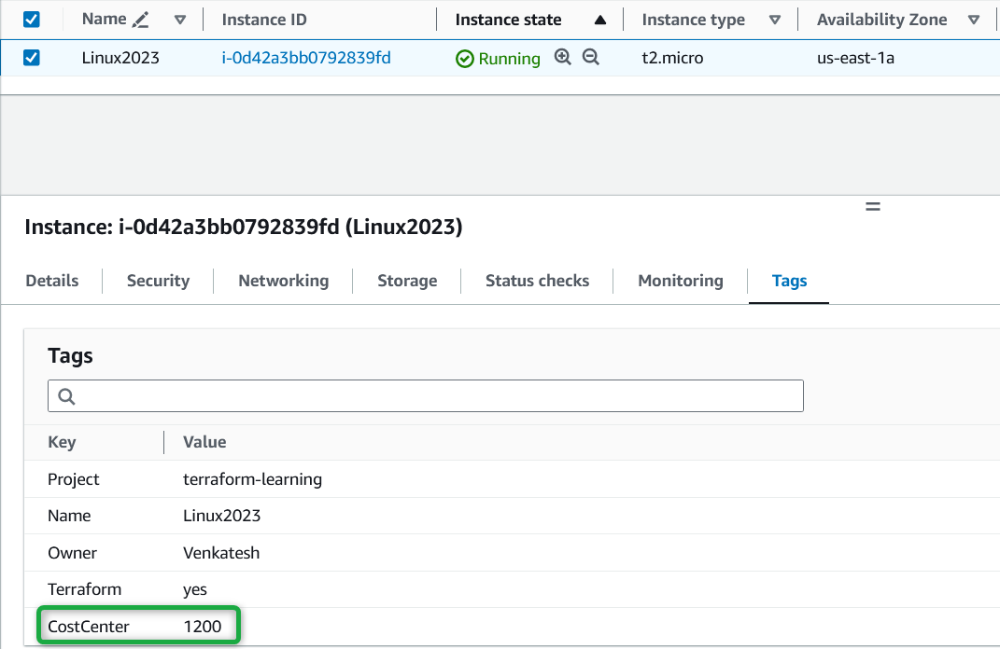
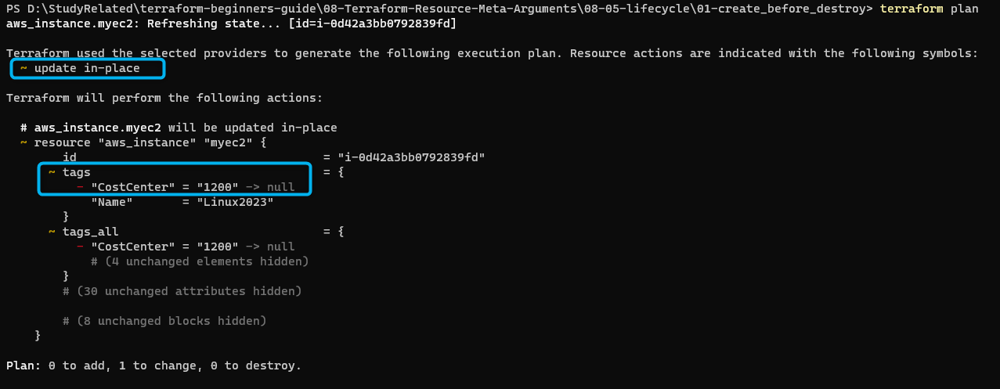

## Terraform Meta Argument: *`lifecycle`*

### ***`lifecycle`*** Meta Argument

- The `lifecycle` Meta Argument in Terraform is used to control specific aspects of **how resources are managed during their lifecycle**. 
- The `lifecycle` Meta Argument provides fine-grained control over **when and how Terraform should create, update, or delete resources**.

- `lifecycle` Meta Argument options: 

    1. ***`create_before_destroy`***: 
        - When set to `true`, this attribute indicates that **Terraform should create a new resource before destroying the old one** when it needs to replace the resource. 
        - This can help minimize downtime during updates.
        - Default option is *`false`*

    2. ***`prevent_destroy`***: 
        - When set to `true`, this attribute **prevents the resource from being destroyed or deleted**. 
        - This can be useful in protecting critical resources from accidental deletion.
        - Default option is *`false`*

    3. ***`ignore_changes`***: 
        - This attribute allows you to specify a list of attributes for which Terraform should ignore changes. 
        - It's useful to prevent certain attributes from being updated during resource modifications.
        - Commonly used when you have some attributes that users are allowed to make changes on AWS console and you want terraform to ignore such changes
        - Example : minor version upgrade of RDS instance
        - Default option is *`false`*

- **Example**: ***`create_before_destroy`***  
    [00_provider.tf](./01-create_before_destroy/00_provider.tf)

    ```hcl
    terraform {
    required_providers {
        aws = {
            source = "hashicorp/aws"
            version = "~> 5.0"
        }
    }
    }

    provider "aws" {
        region = "us-east-1"

        default_tags {
        tags = {
            Terraform = "yes"
            Project = "terraform-learning"
            Owner = "Venkatesh"
        }
        }
    }
    ```
     [01_ec2.tf](./01-create_before_destroy/01_ec2.tf)  

    ```hcl
    resource "aws_instance" "myec2" {
        ami = "ami-0df435f331839b2d6"
        instance_type = "t2.micro"
        availability_zone = "us-east-1a"
        # availability_zone = "us-east-1b"

        tags = {
        Name = "Linux2023"
        }

        # lifecycle {
        #   create_before_destroy = true
        # }
    }
    ``` 
- Lets create an AWS EC2 without `lifecycle` arguments

    1. ***`terraform init`*** : *Initialize* terraform
    2. ***`terraform validate`*** : *Validate* terraform code
    3. ***`terraform fmt`*** : *format* terraform code
    4. ***`terraform plan`*** : *Review* the terraform plan
    5. ***`terraform apply`*** : *Create* Resources by terraform

        - Once terraform completes the execution you should be able to check on your AWS Console Resource created successfully
            

- Now lets try to change the Availability Zone of our EC2 Instance to **without `lifecycle`** arguments and observe the behavior 

    ```hcl
    resource "aws_instance" "myec2" {
        ami = "ami-0df435f331839b2d6"
        instance_type = "t2.micro"
        # availability_zone = "us-east-1a"
        availability_zone = "us-east-1b"

        tags = {
        Name = "Linux2023"
        }

        # lifecycle {
        #   create_before_destroy = true
        # }
    }
    ``` 

- Lets Execute Terraform commands to understand resource behavior

    1. ***`terraform init`*** : *Initialize* terraform
    2. ***`terraform validate`*** : *Validate* terraform code
    3. ***`terraform fmt`*** : *format* terraform code
    4. ***`terraform plan`*** : *Review* the terraform plan
    5. ***`terraform apply`*** : *Create* Resources by terraform

    * Once we run *`terraform apply`* , Terraform first destroys existing resources first and than creates the resource

        - Example of *`terraform apply`*

            

            

            

            

- Now lets try to change the Availability Zone of our EC2 Instance to **with `lifecycle`** arguments and observe the behavior 

    ```hcl
    resource "aws_instance" "myec2" {
        ami = "ami-0df435f331839b2d6"
        instance_type = "t2.micro"
        availability_zone = "us-east-1a"
        # availability_zone = "us-east-1b"

        tags = {
        Name = "Linux2023"
        }

        lifecycle {
          create_before_destroy = true
        }
    }
    ``` 
    * Once we run *`terraform apply`* , Terraform first **creates new  resources first, and than destroys the existing resource**

        - Example of *`terraform apply`*

            

            

            


- **Example**: ***`prevent_destroy`*** 

    - lets use *`prevent_destroy`* argument and observe the behavior  
     [01_ec2.tf](./02-prevent_destroy/02_ec2.tf)  

        ```hcl
        resource "aws_instance" "myec2" {
        ami               = "ami-0df435f331839b2d6"
        instance_type     = "t2.micro"
        availability_zone = "us-east-1a"
        # availability_zone = "us-east-1b"

        tags = {
            Name = "Linux2023"
        }

        lifecycle {
            prevent_destroy = true
        }
        }
        ```
    - Execute *`terraform destroy`* command and observe the behavior
        - Terraform shows **Error: Instance cannot be destroyed** 
    
        


- **Example**: ***`ignore_changes`*** 

    - Lets use the tags concept and understand how `ignore_changes` works
    - First we are going to **manually add *`tag`* on our AWS EC2 using AWS console** ( this tag was not part of terraform code)

        


    - Run *terraform plan* and see how terraform detects the changes that are made on AWS Console
    - Terraform detects the Manual changes made on AWS console and if we run *terraform apply* than terraform will remove the manually applied tags on AWS EC2
        

    - Now, lets add in meta argument `ignore_changes` for *tags* and see how terraform behaves.
    [01_ec2.tf](./03-ignore_changes/01_ec2.tf) 

        ```hcl
        resource "aws_instance" "myec2" {
        ami               = "ami-0df435f331839b2d6"
        instance_type     = "t2.micro"
        availability_zone = "us-east-1a"
        # availability_zone = "us-east-1b"

        tags = {
            Name = "Linux2023"
        }

        lifecycle {
            ignore_changes = [ tags ]
        }
        }
        ```
    - Run *terraform plan* and see how terraform **ignores* the changes** that are made to tags AWS Console
         


 
    #### Cleanup 
 
    6. ***`terraform destroy`*** : *destroy or delete* Resources, Cleanup the resources we created
        - After you type ***yes*** to *`terraform destroy`* prompt, terraform will start **destroying** resources

        - Once terraform completes the execution you should be able to check on your AWS Console resources are successfully deleted.

### References :

[The lifecycle Meta-Argument](https://developer.hashicorp.com/terraform/language/meta-arguments/lifecycle)