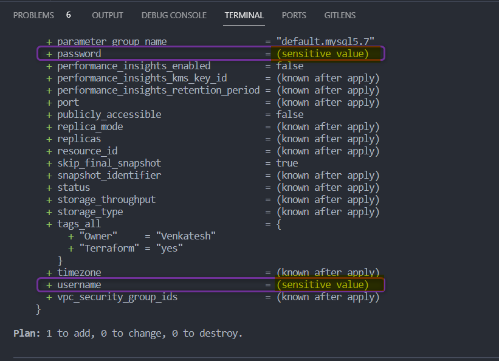
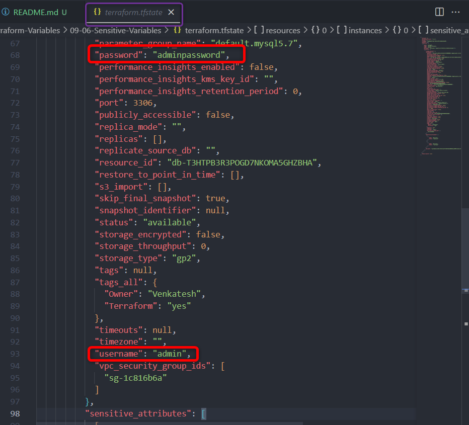

# Terraform Variables

## Sensitive Input Variables

- To manage sensitive input variables in Terraform, you can use the ***`sensitive`*** argument in the variable block
- By setting *`sensitive = true`*, you indicate that the value of this variable is sensitive, and Terraform will handle it accordingly.
- **Terraform won't display the actual values of sensitive variables** in the console or logs during plan or apply operations. Instead, it will show a placeholder ***`(sensitive value)`***
- If a sensitive variable is used in an `output` value, the **output will also be treated as sensitive**, and its value won't be displayed.
- **Important Note :** Though Terraform helps with visibility and protection of sensitive data, you should still follow best practices for handling secrets, such as using a secrets management system (AWS Secret Manager), restricting access to sensitive information, and not hardcoding secrets directly in your configuration files.


- **Example**:  

    [00_provider.tf](./00_provider.tf)
    ```hcl
    terraform {
    required_providers {
        aws = {
        source  = "hashicorp/aws"
        version = "~> 5.0"
        }
    }
    }

    provider "aws" {
    region = var.aws_region

    default_tags {
        tags = {
        Terraform = "yes"
        Owner = var.owner
        }
    }
    }
    ```

    [01_rds.tf](./01_rds.tf)
    ```hcl
    resource "aws_db_instance" "myrds" {
    allocated_storage    = 5
    db_name              = "mydb"
    engine               = "mysql"
    engine_version       = "5.7"
    instance_class       = "db.t2.micro"
    username             = var.db_username
    password             = var.db_password
    parameter_group_name = "default.mysql5.7"
    skip_final_snapshot  = true
    }
    ```

    [02_variables.tf](./02_variables.tf)
    ```hcl
    variable "aws_region" {
    description = "AWS Region In Which Resources will be Created"
    type        = string
    default     = "us-east-1"
    }

    variable "owner" {
    description = "Name of the Engineer who is creating Resources"
    type        = string
    default     = "Venkatesh"
    }

    variable "db_username" {
    description = "DB User Name"
    type        = string
    sensitive = true
    }

    variable "db_password" {
    description = "DB Password"
    type        = string
    sensitive = true
    }
    ```
    [03_secrets.tfvars](./03_secrets.tfvars)
    ```hcl
    # This is for Learning purpose only do not store sensitive information in plain file like this nor push the code to github repo.
    # use AWS Secret manager to store and retrieve your secrets

    db_username = "admin"
    db_password = "adminpassword"
    ```

- In the above example,
    variable `db_username` and `db_password` are marked *`sensitive = true`* 


- ***`terraform apply`*** Output

    - You can notice `db_username` and `db_password` are marked with value ***`(sensitive value)`***

    

- ***`terraform state file`***
    - Please note **terraform state file `terraform.tfstate` will store the sensitive information in plain text**, so be careful on how you want to use this. 

    


    <details> 
    <summary> <i>terraform apply</i> </summary>

    ```hcl
    $ terraform apply -var-file 03_secrets.tfvars 

    Terraform used the selected providers to generate the following execution plan. Resource actions are indicated with the following symbols:
    + create

    Terraform will perform the following actions:

    # aws_db_instance.myrds will be created
    + resource "aws_db_instance" "myrds" {
        + address                               = (known after apply)
        + allocated_storage                     = 5
        + apply_immediately                     = false
        + arn                                   = (known after apply)
        + auto_minor_version_upgrade            = true
        + availability_zone                     = (known after apply)
        + backup_retention_period               = (known after apply)
        + backup_target                         = (known after apply)
        + backup_window                         = (known after apply)
        + ca_cert_identifier                    = (known after apply)
        + character_set_name                    = (known after apply)
        + copy_tags_to_snapshot                 = false
        + db_name                               = "mydb"
        + db_subnet_group_name                  = (known after apply)
        + delete_automated_backups              = true
        + endpoint                              = (known after apply)
        + engine                                = "mysql"
        + engine_version                        = "5.7"
        + engine_version_actual                 = (known after apply)
        + hosted_zone_id                        = (known after apply)
        + id                                    = (known after apply)
        + identifier                            = (known after apply)
        + identifier_prefix                     = (known after apply)
        + instance_class                        = "db.t2.micro"
        + iops                                  = (known after apply)
        + kms_key_id                            = (known after apply)
        + latest_restorable_time                = (known after apply)
        + license_model                         = (known after apply)
        + listener_endpoint                     = (known after apply)
        + maintenance_window                    = (known after apply)
        + master_user_secret                    = (known after apply)
        + master_user_secret_kms_key_id         = (known after apply)
        + monitoring_interval                   = 0
        + monitoring_role_arn                   = (known after apply)
        + multi_az                              = (known after apply)
        + nchar_character_set_name              = (known after apply)
        + network_type                          = (known after apply)
        + option_group_name                     = (known after apply)
        + parameter_group_name                  = "default.mysql5.7"
        + password                              = (sensitive value)
        + performance_insights_enabled          = false
        + performance_insights_kms_key_id       = (known after apply)
        + performance_insights_retention_period = (known after apply)
        + port                                  = (known after apply)
        + publicly_accessible                   = false
        + replica_mode                          = (known after apply)
        + replicas                              = (known after apply)
        + resource_id                           = (known after apply)
        + skip_final_snapshot                   = true
        + snapshot_identifier                   = (known after apply)
        + status                                = (known after apply)
        + storage_throughput                    = (known after apply)
        + storage_type                          = (known after apply)
        + tags_all                              = {
            + "Owner"     = "Venkatesh"
            + "Terraform" = "yes"
            }
        + timezone                              = (known after apply)
        + username                              = (sensitive value)
        + vpc_security_group_ids                = (known after apply)
        }

    Plan: 1 to add, 0 to change, 0 to destroy.

    Do you want to perform these actions?
    Terraform will perform the actions described above.
    Only 'yes' will be accepted to approve.

    Enter a value: yes

    aws_db_instance.myrds: Creating...
    aws_db_instance.myrds: Still creating... [10s elapsed]
    aws_db_instance.myrds: Still creating... [20s elapsed]
    aws_db_instance.myrds: Still creating... [30s elapsed]
    aws_db_instance.myrds: Still creating... [40s elapsed]
    aws_db_instance.myrds: Still creating... [50s elapsed]
    aws_db_instance.myrds: Still creating... [1m0s elapsed]
    aws_db_instance.myrds: Still creating... [1m10s elapsed]
    aws_db_instance.myrds: Still creating... [1m20s elapsed]
    aws_db_instance.myrds: Still creating... [1m30s elapsed]
    aws_db_instance.myrds: Still creating... [1m40s elapsed]
    aws_db_instance.myrds: Still creating... [1m50s elapsed]
    aws_db_instance.myrds: Still creating... [2m0s elapsed]
    aws_db_instance.myrds: Still creating... [2m10s elapsed]
    aws_db_instance.myrds: Still creating... [2m20s elapsed]
    aws_db_instance.myrds: Still creating... [2m30s elapsed]
    aws_db_instance.myrds: Still creating... [2m40s elapsed]
    aws_db_instance.myrds: Still creating... [2m50s elapsed]
    aws_db_instance.myrds: Still creating... [3m0s elapsed]
    aws_db_instance.myrds: Still creating... [3m10s elapsed]
    aws_db_instance.myrds: Still creating... [3m20s elapsed]
    aws_db_instance.myrds: Still creating... [3m30s elapsed]
    aws_db_instance.myrds: Still creating... [3m40s elapsed]
    aws_db_instance.myrds: Still creating... [3m50s elapsed]
    aws_db_instance.myrds: Still creating... [4m0s elapsed]
    aws_db_instance.myrds: Still creating... [4m10s elapsed]
    aws_db_instance.myrds: Still creating... [4m20s elapsed]
    aws_db_instance.myrds: Still creating... [4m30s elapsed]
    aws_db_instance.myrds: Still creating... [4m40s elapsed]
    aws_db_instance.myrds: Still creating... [4m50s elapsed]
    aws_db_instance.myrds: Creation complete after 4m54s [id=db-T3HTPB3R3POAB7NKOMA5XYZBHA]

    Apply complete! Resources: 1 added, 0 changed, 0 destroyed.
    ```

    </details>


## References : 

[Terraform Custom Conditions](https://developer.hashicorp.com/terraform/language/expressions/custom-conditions)


