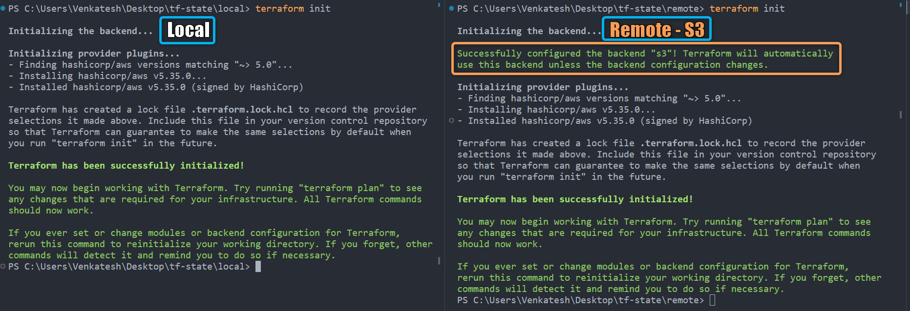
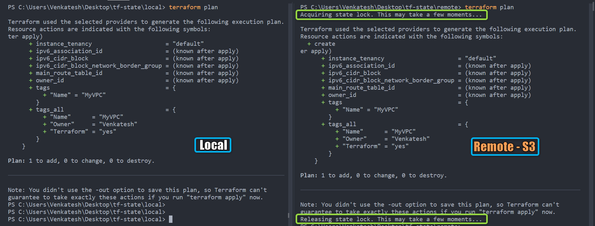
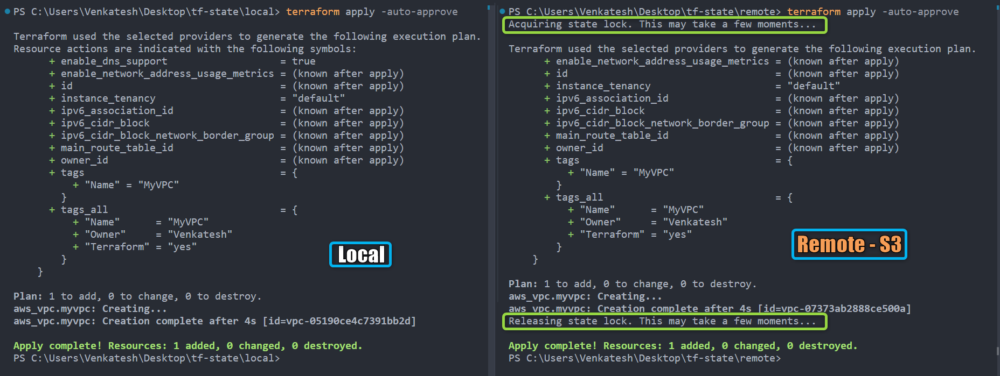
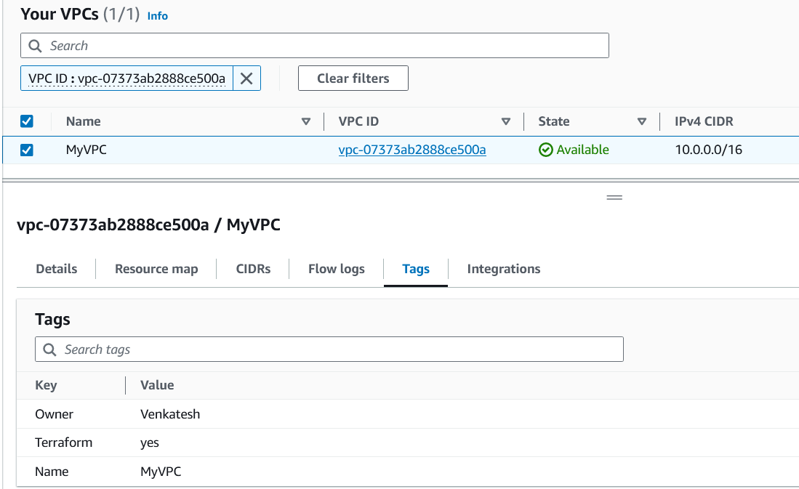
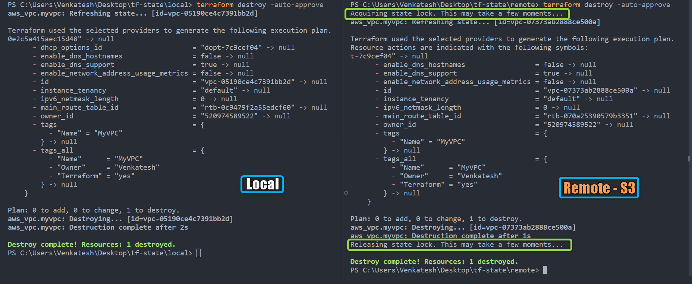

# Terraform State

## Terraform State File

- The Terraform state file (*`terraform.tfstate`*) is a critical component in managing infrastructure.
- The state is used by Terraform 
    - **to map real world resources to your configuration**
    - **keep track of metadata**
    - **To improve performance** for large infrastructures
- Terraform uses state **to determine which changes to make to your infrastructure**. 
- Prior to any operation, Terraform does a ***refresh*** to update the state with the real infrastructure.

### Purpose of the State File:

1. **Tracking Resources**: Stores the current state of defined resources with details like resource IDs and IP addresses.

2. **Dependency Management**: Manages dependencies between resources, ensuring correct application order for changes.

3. **Concurrency and Locking**: Handles concurrent access by using state locks to prevent conflicts.

### State File Location:

- By default, the state file is **stored locally in the same directory**. 
- For large Enterprise Infrastructure, it's recommended to use ***remote backends*** (**AWS S3, Azure Storage, terraform Cloud** etc.) to enable collaboration and avoid local state file issues.
- Using a **remote backend enhances security, collaboration, and version control** in Terraform workflows.


## Local State vs. Remote State

| **Type**                  | **Local State**                                | **Remote State (AWS S3)**                          |
|---------------------------|------------------------------------------------|----------------------------------------------------|
| **Location**              | Stored **locally** in the project directory.   | Stored in a **remote** backend, e.g., AWS S3.      |
| **Concurrency**           | Not suitable for collaboration. Lacks locking. | **Enables collaboration** with backend locking.    |
| **Security**              | Sensitive information may be exposed.          | **Fine-grained access** control with AWS IAM policies. |
| **Backups**               | Prone to **accidental deletion** or loss.      | **Version Controlled**, Automatic durability & availability with S3.|

### Advantages of Remote State (AWS S3):
- **Collaboration**: Supports team collaboration by providing a centralized location for state files.
- **Locking Mechanisms**: Prevents conflicts during concurrent operations.
- **Security**: Uses AWS IAM roles and policies for access control.
- **Version Controlled** : Take advantage of S3 versioning
- **Durability and Availability**: AWS S3 ensures automatic durability and availability for state files.

### Implementing AWS S3 as a Remote State Backend and DynamoDB for State locking:

1. [Create S3 bucket](https://docs.aws.amazon.com/AmazonS3/latest/userguide/creating-bucket.html) on your AWS Account. 
    - Ex: **tf-aws-backend** ( Buckets names are unique, so choose unique name of your choice)
    

2. Create folder **tf/dev** (you can choose any name of your choice) here **tf/dev** only mean its terraform and dev environment
    - 

3. [Create a DynamoDB table](https://docs.aws.amazon.com/amazondynamodb/latest/developerguide/getting-started-step-1.html) for facilitating state file locking
    - Table Name: **tf-dev-state-lock**
    - Partition key (Primary Key): **LockID** (Type as String)
    - Table settings: Use default settings (checked)

    - 

4. use terraform *`backend`* block to configure remote state 

**Syntax**: 

```hcl
terraform {
  backend "s3" {
    bucket         = "tf-aws-backend"
    key            = "tf/dev/terraform.tfstate"
    region         = "us-east-1"
    encrypt        = true
    dynamodb_table = "tf-dev-state-lock"
  }
}
```

**Example**: 
- Lets Create A Simple VPC and observe terraform state behavior with S3 and DynamoDB


[00_provider.tf](./00_provider.tf)

```hcl
terraform {
  required_providers {
    aws = {
      source  = "hashicorp/aws"
      version = "~> 5.0"
    }
  }
}

provider "aws" {
  region = var.aws_region

  default_tags {
    tags = {
      Terraform = "yes"
      Owner     = var.owner
    }
  }
}
```

[01_backend.tf](./01_backend.tf)

```hcl
terraform {
  backend "s3" {
    bucket         = "tf-aws-backend"
    key            = "tf/dev/terraform.tfstate"
    region         = "us-east-1"
    dynamodb_table = "tf-dev-state-lock"
  }
}
```

[02_variables.tf](./02_variables.tf)

```hcl
variable "aws_region" {
  description = "AWS Region In Which Resources will be Created"
  type        = string
  default     = "us-east-1"
}

variable "owner" {
  description = "Name of the Engineer who is creating Resources"
  type        = string
  default     = "Venkatesh"
}

```

[03_vpc.tf](./03_vpc.tf)

```hcl
resource "aws_vpc" "myvpc" {
  cidr_block = "10.0.0.0/16"

  tags = {
    Name = "MyVPC"
  }
}
```

- In the above example, We are trying to Create A Simple VPC and observe terraform state behavior with S3 and DynamoDB  

    1\. `cidr_block` = `10.0.0.0/16`, is the VPC CIDR  

- Lets Execute Terraform commands to understand data source behavior

    1. ***`terraform init`*** : *Initialize* terraform
    2. ***`terraform validate`*** : *Validate* terraform code
    3. ***`terraform fmt`*** : *format* terraform code
    4. ***`terraform plan`*** : *Review* the terraform plan
    5. ***`terraform apply`*** : *Create* Resources by terraform

- For Comparison Im also running similar code ([local](./tf-state-demo-files/local/)) without S3 as backend and see how terraform behaves in each case.

  - **`terraform files`** : 

    

    | Type              | Local           | Remote                     |
    |-------------------|-----------------|----------------------------|
    | **Backend File**  | No backend file | [*01_backend.tf*](./01_backend.tf) backend file |

  - ***`terraform init`*** : 

    

    | Type                      | Local                           | Remote                                   |
    |---------------------------|---------------------------------|------------------------------------------|
    | **Backend**               | Not explicitly mentioned        | Configured with "s3"                     |
    | **Backend Initialization**| Local initialization message    | Successfully configured the backend "s3"!  |

  - ***`terraform plan`*** : 

    

    | Type              | Local            | Remote                                        |
    |-------------------|------------------|-----------------------------------------------|
    | **State Locking** | No State Locking | ***Acquires*** and ***Releases***  state lock |

  - ***`terraform Apply`*** : 

    

    | Type              | Local            | Remote                                        |
    |-------------------|------------------|-----------------------------------------------|
    | **State Locking** | No State Locking | ***Acquires*** and ***Releases***  state lock |

  - **`terraform State File`** : 

    

    | Type                    | Local          | Remote                       |
    |-------------------------|----------------|------------------------------|
    | **State File Location** | Stored *locally* | Stored *remotely* in S3 Bucket |

  <details> 
  <summary> <i>terraform apply</i> </summary>
    
    ```hcl
        PS C:\Users\Venkatesh\Desktop\tf-state\remote> terraform apply -auto-approve
    Acquiring state lock. This may take a few moments...

    Terraform used the selected providers to generate the following execution plan.
          + enable_network_address_usage_metrics = (known after apply)
          + id                                   = (known after apply)
          + instance_tenancy                     = "default"
          + ipv6_association_id                  = (known after apply)
          + ipv6_cidr_block                      = (known after apply)
          + ipv6_cidr_block_network_border_group = (known after apply)
          + main_route_table_id                  = (known after apply)
          + owner_id                             = (known after apply)
          + tags                                 = {
              + "Name" = "MyVPC"
            }
          + tags_all                             = {
              + "Name"      = "MyVPC"
              + "Owner"     = "Venkatesh"
              + "Terraform" = "yes"
            }
        }

    Plan: 1 to add, 0 to change, 0 to destroy.
    aws_vpc.myvpc: Creating...
    aws_vpc.myvpc: Creation complete after 4s [id=vpc-07373ab2888ce500a]
    Releasing state lock. This may take a few moments...
    ```
  </details>

 - You can now find AWS Console the VPC with CIDR 10.0.0.0/16 created.

    

  - ***`terraform Destroy`*** : 

    

    | Type              | Local            | Remote                                        |
    |-------------------|------------------|-----------------------------------------------|
    | **State Locking** | No State Locking | ***Acquires*** and ***Releases***  state lock |


    <details> 
    <summary> <i>terraform destroy</i> </summary>

    ```hcl
    PS C:\Users\Venkatesh\Desktop\tf-state\remote> terraform destroy -auto-approve
    Acquiring state lock. This may take a few moments...
    aws_vpc.myvpc: Refreshing state... [id=vpc-07373ab2888ce500a]

    Terraform used the selected providers to generate the following execution plan.
    Resource actions are indicated with the following symbols:
    t-7c9cef04" -> null
          - enable_dns_hostnames                 = false -> null
          - enable_dns_support                   = true -> null
          - enable_network_address_usage_metrics = false -> null
          - id                                   = "vpc-07373ab2888ce500a" -> null   
          - instance_tenancy                     = "default" -> null
          - ipv6_netmask_length                  = 0 -> null
          - main_route_table_id                  = "rtb-070a25390579b3351" -> null   
          - owner_id                             = "520974589522" -> null
          - tags                                 = {
              - "Name" = "MyVPC"
            } -> null
          - tags_all                             = {
              - "Name"      = "MyVPC"
              - "Owner"     = "Venkatesh"
              - "Terraform" = "yes"
            } -> null
        }

    Plan: 0 to add, 0 to change, 1 to destroy.
    aws_vpc.myvpc: Destroying... [id=vpc-07373ab2888ce500a]
    aws_vpc.myvpc: Destruction complete after 1s
    Releasing state lock. This may take a few moments...

    Destroy complete! Resources: 1 destroyed.
    PS C:\Users\Venkatesh\Desktop\tf-state\remote>
    ```
    </details>

## References : 

Terraform State : https://developer.hashicorp.com/terraform/language/state

<!-- Terraform State : [https://developer.hashicorp.com/terraform/language/state](https://developer.hashicorp.com/terraform/language/state) -->


